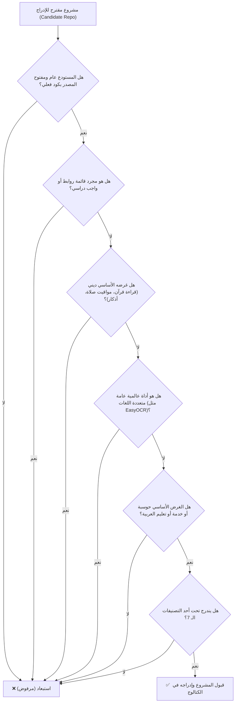
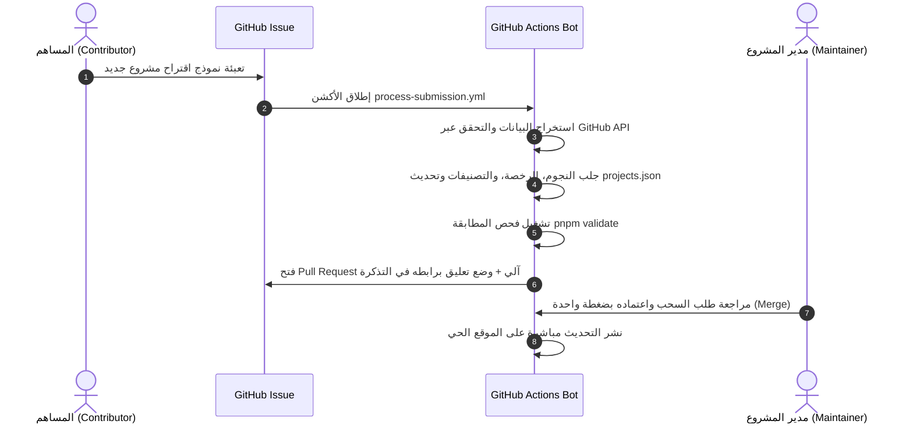

<div align="center">

# 🌟 دليل البرمجيات العربية مفتوحة المصدر
### Arabic Open Source Directory & Showcase Hub

**الدليل المركزي الحي والمفتوح لتوثيق، فهرسة، واستعراض أفضل المشاريع والمكتبات والنماذج الذكية المخصصة لخدمة وحوسبة اللغة العربية.**  
*The premier living showcase and centralized directory celebrating open-source packages, libraries, models, and tools developed specifically for the Arabic language.*

---

[](https://aros.osamamabkhot.dev)
[](https://aros.osamamabkhot.dev#projects)
[](https://aros.osamamabkhot.dev)
[](https://github.com/O2sa/arabic-opensource-directory/actions)
[](LICENSE)

<br />

**[🌐 زيارة المنصة الحية](https://aros.osamamabkhot.dev)** •
**[🚀 اقترح مشروعاً جديداً](https://github.com/O2sa/arabic-opensource-directory/issues/new?template=submit-project.yml)** •
**[📑 معايير وسياسة القبول](docs/INCLUSION_CRITERIA.md)** •
**[🤝 دليل المساهمة](CONTRIBUTING.md)** •
**[📦 استخدام البيانات المفتوحة (API)](#-استخدام-البيانات-المفتوحة-كـ-api--open-data-access)**

</div>

---

## 📌 جدول المحتويات | Table of Contents
1. [عن المشروع ورسالته | About The Project](#-عن-المشروع-ورسالة-المنصة--about-the-project)
2. [أبرز المميزات التقنية | Key Features](#-أبرز-المميزات-التقنية--key-features)
3. [التصنيفات المعتمدة الـ 7 | Core Categories](#-التصنيفات-المعتمدة-الـ-7--the-7-core-categories)
4. [معايير وسياسة قبول المشاريع | Inclusion Policy](#-معايير-وسياسة-قبول-المشاريع--inclusion-policy)
5. [كيفية المساهمة وإضافة المشاريع (حصرياً عبر Issues) | How to Submit](#-كيفية-المساهمة-وإضافة-المشاريع--how-to-submit-a-project)
6. [المساهمة البرمجية في المنصة | Code & Platform Contributions](#-المساهمة-البرمجية-في-المنصة--code--platform-contributions)
7. [استخدام البيانات المفتوحة كـ API | Open Data Access](#-استخدام-البيانات-المفتوحة-كـ-api--open-data-access)
8. [بنية وهيكلية المستودع | Repository Architecture](#-بنية-وهيكلية-المستودع--repository-architecture)
9. [خطوط الأتمتة التلقائية | Automation Pipelines](#-خطوط-الأتمتة-التلقائية--automation-pipelines)
10. [التشغيل والتطوير المحلي | Local Development Guide](#-التشغيل-والتطوير-المحلي--local-development-guide)
11. [الترخيص وشكر وتقدير | License & Credits](#-الترخيص-وشكر-وتقدير--license--credits)

---

## 📖 عن المشروع ورسالة المنصة | About The Project

تزخر المنظومة التقنية بمئات الجهود الفردية والمؤسسية والمختبرات البحثية التي طورت حلولاً برمجية نوعية للغة العربية، لكن الكثير منها ظل متناثراً يصعب العثور عليه. 

يهدف **دليل البرمجيات العربية مفتوحة المصدر** إلى سد هذه الفجوة عبر:
* **فهرسة شاملة وموثوقة:** حصر البرمجيات المخصصة لخدمة اللغة العربية في كتالوج موحد ومراجع بدقة.
* **رصد حي للإحصائيات:** متابعة تفاعل المجتمع مع المشاريع (عدد النجوم، الفروع، آخر تحديث، والرخص المعتمدة).
* **إتاحة البيانات للجميع:** توفير قاعدة البيانات مجاناً وبصيغة مهيكلة للباحثين والمطورين لتمكين بناء المزيد من الحلول.

---

## ✨ أبرز المميزات التقنية | Key Features

* ⚡ **تطبيق فائق السرعة والأداء (SPA):** مبني بأحدث إصدارات **React 18** و **TypeScript** و **Vite** لتقديم تجربة تصفح سلسة وفورية.
* 🌐 **دعم كامل لثنائية اللغة والاتجاه (RTL / LTR):** تبديل فوري بين الواجهة العربية والإنجليزية مع ضبط دقيق لكافة عناصر الواجهة.
* 🔍 **محرك بحث وتصفية متقدم:** بحث لحظي بالاسم والوصف والوسوم، مع فلترة متعددة الأبعاد بحسب التصنيف الأساسي، ولغات البرمجة، وحالة النشاط، والمشاريع المميزة (Featured).
* 🤖 **أتمتة كاملة لدورة الإضافة والتحديث (GitHub Actions):**
  - معالجة طلبات الإضافة الجديدة والتحقق من المستودعات وفتح الـ PRs تلقائياً.
  - مزامنة دورية مجدولة لجلب إحصائيات GitHub الحية دون أي تدخل يدوي.
* 🌙 **تصميم عصري متكيف (Dark & Light Mode):** يدعم المظهرين الداكن والفاتح مع خطوط عربية رائدة ومختارة بعناية (`IBM Plex Sans Arabic`).
* 📱 **متجاوب 100% مع كافة الشاشات:** تجربة استخدام مثالية على الهواتف الذكية، الأجهزة اللوحية، وشاشات سطح المكتب.
* 🚀 **تحسين شامل لمحركات البحث (SEO & Social Cards):** دعم Open Graph، وتوليد خرائط المواقع (Sitemap)، ومسارات مُهيأة لمحركات البحث.

---

## 🗂️ التصنيفات المعتمدة الـ 7 | The 7 Core Categories

تُوزع جميع المشاريع المدرجة بدقة تحت 7 تصنيفات رئيسية:

| الأيقونة | التصنيف بالعربية | Category (EN) | المعرف (ID) | مجالات التركيز وأمثلة |
| :---: | :--- | :--- | :---: | :--- |
| 🧠 | **الذكاء الاصطناعي ومعالجة اللغات** | NLP & Artificial Intelligence | `nlp-ai` | النماذج اللغوية الكبيرة (LLMs)، المحولات، تصنيف النصوص، تحليل المشاعر، والتضمينات. *(مثل: CAMeL Tools, Jais, AraBERT)* |
| ✍️ | **معالجة النصوص والتشكيل والصرف** | Text Processing & Tashkeel | `text-tashkeel` | التشكيل الآلي، التجذيع، الإعراب، المعالجة الصرفية، والتدقيق الإملائي. *(مثل: PyArabic, Tashkeela, Mishkal)* |
| 🎨 | **الخطوط والطباعة الرقمية** | Fonts & Digital Typography | `fonts-calligraphy` | الخطوط الرقمية المفتوحة بمختلف الأنماط (نسخ، رقعة، كوفي، مونو)، وضبط الكشيدة. *(مثل: Amiri, Cairo, Scheherazade)* |
| 🛠️ | **مكتبات وأدوات المطورين** | Developer Libraries & Tools | `dev-tools` | حزم لمختلف اللغات (JS, Python, Go, Rust)، تحويل الأرقام لكلمات، ومساعدات النصوص. *(مثل: Tafqit, Arabic-Persian-Reshaper)* |
| 👁️ | **التعرف الضوئي والرؤية الحاسوبية** | OCR & Computer Vision | `ocr-vision` | استخراج النصوص العربية من الصور والمخطوطات والمستندات القديمة والخط اليدوي. *(مثل: Arabic-OCR, Kraken models)* |
| 📚 | **المعاجم وقواعد البيانات** | Dictionaries & Datasets | `dictionaries-datasets` | القواميس الرقمية، المعاجم، والمدونات اللغوية لتدريب واختبار النماذج الذكية. *(مثل: Arabic WordNet, KACST Corpora)* |
| 💻 | **المنصات والتطبيقات المتكاملة** | Platforms & Web Apps | `platforms-apps` | منصات ويب متكاملة وتطبيقات تفاعلية لخدمة المحتوى والتعليم باللغة العربية. *(مثل: Nakhlah.js, Qawafi)* |

---

## 📜 معايير وسياسة قبول المشاريع | Inclusion Policy

للحفاظ على جودة ومصداقية الدليل، يُشترط أن يكون المشروع **مبنياً في أصله وجوهره لخدمة وحوسبة اللغة العربية (Arabic-Centric)**.



> لمطالعة كافة الشروط والخطوط الحمراء للاستبعاد والأمثلة التوضيحية، راجع:  
> 📄 **[وثيقة معايير وسياسة قبول وإدراج المشاريع الرسمية (docs/INCLUSION_CRITERIA.md)](docs/INCLUSION_CRITERIA.md)**

---

## 🚀 كيفية المساهمة وإضافة المشاريع | How to Submit a Project

> [!IMPORTANT]
> **إضافة المشاريع الجديدة متاحة حصرياً عبر نموذج التذاكر (GitHub Issues)!**  
> **New project submissions are accepted EXCLUSIVELY via GitHub Issues.**  
> يُرجى **عدم** فتح طلبات سحب (Pull Requests) يدوية لتعديل ملف `data/projects.json` مباشرة؛ حيث يتولى خط الأتمتة الذكي فحص المستودع وجلب الإحصائيات وبناء طلب السحب تلقائياً.

### خطوات تقديم مشروع جديد في دقيقة واحدة:
1. انتقل إلى نموذج تقديم المشاريع الرسمي:  
   👉 **[🚀 Submit an Arabic Project / اقتراح مشروع عربي](https://github.com/O2sa/arabic-opensource-directory/issues/new?template=submit-project.yml)**
2. املأ حقول النموذج:
   - **رابط المستودع (GitHub URL)**: مثل `https://github.com/owner/repo`.
   - **التصنيف الأساسي (Category)**: اختر أحد التصنيفات الـ 7.
   - **الاسم والوصف (Titles & Descriptions)**: باللغتين العربية والإنجليزية.
   - **الكلمات المفتاحية (Tags)**: وسوم مفصولة بفواصل مثل `python, nlp, transformers`.
3. اضغط **Submit new issue**.

### ماذا يحدث بعد إرسال التذكرة؟


---

## 💻 المساهمة البرمجية في المنصة | Code & Platform Contributions

نرحب ونسعد جداً بطلبات السحب (Pull Requests) الموجهة لتطوير منصة الدليل نفسها!

* 🎨 **الواجهات والتصميم**: تحسين التصميم، الألوان، الخطوط، وتناسق الواجهات.
* ⚡ **الميزات والوظائف**: تطوير محرك البحث والفلاتر والمقارنة ومشاركة الروابط.
* 🌐 **التدويل (i18n)**: تدقيق الترجمات وإضافة لغات جديدة.
* 🛠️ **الأتمتة والسكربتات**: تحسين سكربتات الاستكشاف والجلب والتحقق.

> لمزيد من الإرشادات حول إعداد بيئة التطوير وفتح الـ PRs، راجع **[دليل المساهمة (CONTRIBUTING.md)](CONTRIBUTING.md)**.

---

## 📦 استخدام البيانات المفتوحة كـ API | Open Data Access

جميع بيانات الدليل مفتوحة ومتاحة بصيغة JSON مهيكلة ومحدثة دورياً، ويمكنك استخدامها في أبحاثك أو مشاريعك وتطبيقاتك الخاصة بحرية:

* **بيانات الكتالوج الأساسية المعتمدة:** [`data/projects.json`](data/projects.json)
* **بيانات الكتالوج مع الإحصائيات الحية (Live Telemetry):** [`data/projects-enriched.json`](data/projects-enriched.json)
* **رابط الوصول المباشر عبر الويب (Public Endpoint):**  
  `https://aros.osamamabkhot.dev/data/projects-enriched.json`

### أمثلة برمجية لاستخدام البيانات:

#### عبر Python (Requests / Pandas):
```python
import requests
import pandas as pd

url = "https://aros.osamamabkhot.dev/data/projects-enriched.json"
projects = requests.get(url).json()

# تحويل البيانات إلى جدول تحليلي
df = pd.DataFrame(projects)
print(f"إجمالي المشاريع الموثقة: {len(df)}")
print(df[['id', 'category', 'stars', 'license']].head())
```

#### عبر JavaScript / TypeScript (Fetch):
```javascript
const res = await fetch('https://aros.osamamabkhot.dev/data/projects-enriched.json');
const projects = await res.json();

console.log(`Loaded ${projects.length} Arabic projects!`);
```

#### عبر سطر الأوامر (cURL & jq):
```bash
# جلب أفضل 5 مشاريع عربية من حيث عدد النجوم
curl -s https://aros.osamamabkhot.dev/data/projects-enriched.json | \
  jq 'sort_by(-.stars) | .[0:5] | .[] | {name: .title.ar, stars: .stars, repo: .repo}'
```

---

## 🏗️ بنية وهيكلية المستودع | Repository Architecture

```text
arabic-opensource-directory/
├── .github/
│   ├── ISSUE_TEMPLATE/
│   │   ├── config.yml                   # إعدادات واجهة التذاكر وتوجيه المساهمين
│   │   └── submit-project.yml           # نموذج اقتراح مشروع جديد المهيكل
│   ├── workflows/
│   │   ├── process-submission.yml       # خط أتمتة فحص التذاكر وفتح PRs آلياً
│   │   └── sync-and-deploy.yml          # خط أتمتة المزامنة الأسبوعية والنشر
│   └── PULL_REQUEST_TEMPLATE.md         # قالب وتنبيهات طلبات السحب
├── data/
│   ├── categories.json                  # تعريف التصنيفات الـ 7 الأساسية
│   ├── projects.json                    # قاعدة البيانات المعتمدة لجميع المشاريع
│   └── projects-enriched.json           # الكتالوج مع إحصائيات GitHub الحية
├── docs/
│   └── INCLUSION_CRITERIA.md            # الوثيقة الرسمية لمعايير القبول والاستبعاد
├── public/                              # الملفات الثابتة (أيقونات، CNAME، robots، sitemap)
├── scripts/
│   ├── add-project.mjs                  # أداة سطر الأوامر لمدير المشروع لإضافة مشروع محلياً
│   ├── check-candidate.mjs              # أداة فحص مطابقة أي مستودع للمعايير
│   ├── discover.mjs                     # محرك استكشاف وتنبيش المشاريع العربية على GitHub
│   ├── process-submission.mjs           # محرك معالجة التذاكر واستخراج البيانات
│   ├── sync.mjs                         # محرك مزامنة الإحصائيات الحية
│   └── validate.mjs                     # مدقق صحة وسلامة بنية بيانات الكتالوج
├── src/                                 # كود تطبيق React + TypeScript
│   ├── components/                      # مكونات الواجهة (Header, Grid, Filters, Footer)
│   ├── context/                         # سياق اللغة (i18n) والمظهر (Theme)
│   └── types/                           # تعريفات واجهات TypeScript
├── CONTRIBUTING.md                      # الدليل الرسمي للمساهمين
├── package.json                         # الاعتماديات وسكربتات التشغيل
└── vite.config.ts                       # إعدادات مجمع Vite
```

---

## 🤖 خطوط الأتمتة التلقائية | Automation Pipelines

يعتمد المستودع على خطين متقدمين ومستقلين عبر **GitHub Actions**:

### 1. خط معالجة الاقتراحات ([`process-submission.yml`](.github/workflows/process-submission.yml))
* **المشغل:** فوري عند فتح تذكرة اقتراح مشروع جديد.
* **المهام:**
  1. قراءة بيانات النموذج واستخراج الحقول (الرابط، التصنيف، الأوصاف، الوسوم).
  2. الاستعلام من GitHub API للتأكد من وجود المستودع ورخصته المفتوحة ونجومه.
  3. تحديث `data/projects.json` والتخزين المؤقت.
  4. فحص المطابقة البنائية عبر `pnpm run validate`.
  5. إنشاء فرع مستقل ودفع التعديل وفتح Pull Request آلي مربوط بالتذكرة.
  6. وضع تعليق تفاعلي على التذكرة الأصلية برابط الـ PR.

### 2. خط المزامنة الأسبوعية والنشر ([`sync-and-deploy.yml`](.github/workflows/sync-and-deploy.yml))
* **المشغل:** جدول زمني أسبوعي (كل إثنين 04:00 UTC) + عند كل دمج على فرع `main`.
* **المهام:**
  1. استعلام GitHub API وتحديث إحصائيات كافة المشاريع الـ 295+ (النجوم، الفروع، آخر نشاط).
  2. تسجيل الـ Snapshot المحدث في `data/projects-enriched.json`.
  3. بناء حزمة الإنتاج وتوليد مسارات الـ SEO الثابتة وخرائط الموقع.
  4. النشر الفوري والمؤتمت على **GitHub Pages**.

---

## 🛠️ التشغيل والتطوير المحلي | Local Development Guide

### المتطلبات الأساسية:
* **[Node.js](https://nodejs.org/)** (الإصدار 18 فما فوق).
* **[pnpm](https://pnpm.io/)** (الإصدار 9 فما فوق - مدير الحزم الإلزامي للمستودع).

### خطوات الإعداد والتشغيل:
```bash
# 1. استنساخ المستودع
git clone https://github.com/O2sa/arabic-opensource-directory.git
cd arabic-opensource-directory

# 2. تثبيت الاعتماديات
pnpm install

# 3. تشغيل خادم التطوير المحلي مع التحديث الفوري (HMR)
pnpm dev

# 4. فحص صحة وسلامة بيانات الكتالوج
pnpm validate

# 5. بناء حزمة الإنتاج وتوليد ملفات الـ SEO
pnpm build
```

### أدوات سطر الأوامر المفيدة المضمنة (CLI Tools):
```bash
# فحص مشروع مرشح عبر معايير القبول والاستبعاد
node scripts/check-candidate.mjs <owner/repo>

# إضافة مشروع جديد سريعاً من سطر الأوامر (خاص بمديري المشروع)
pnpm add-project --repo <owner/repo> --cat <category-id> --title-ar "..." --title-en "..." --desc-ar "..." --desc-en "..."

# مزامنة إحصائيات GitHub الحية محلياً
pnpm sync
```

---

## 📄 الترخيص وشكر وتقدير | License & Credits

* هذا المشروع متاح كبرمجية مفتوحة المصدر بموجب رخصة **[MIT License](LICENSE)**.
* **شكر وتقدير:** جميع الحقوق الفكرية والأدبية للمشاريع المدرجة تعود لأصحابها ومطوريها والمؤسسات التي أطلقتها. هذا الدليل مبادرة توثيقية واحتفائية تهدف لتعزيز ظهور وتأثير هذه الجهود الرائعة.

<div align="center">

**صُنع بشغف لخدمة ودعم اللغة العربية وحوسبتها 💚**  
*Made with passion to empower the Arabic computational ecosystem.*

**[⭐ ساهم بدعم المشروع عبر وضع نجمة على المستودع على GitHub](https://github.com/O2sa/arabic-opensource-directory)**

</div>
