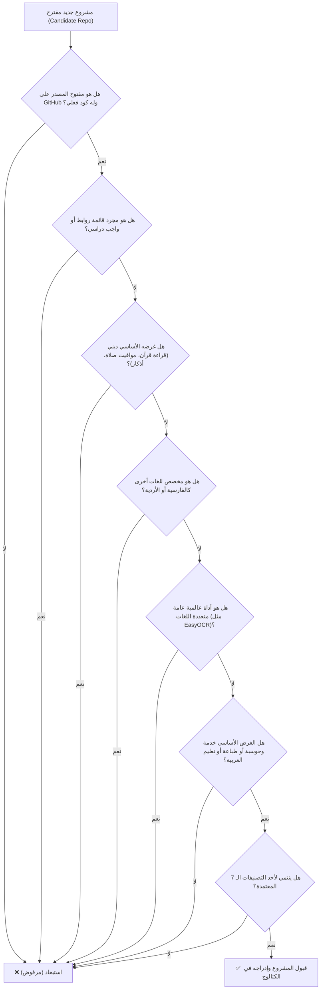

# معايير وسياسة قبول وإدراج المشاريع
# Project Inclusion & Evaluation Policy

> **دليل البرمجيات العربية مفتوحة المصدر | Arabic Open Source Directory**  
> وثيقة رسمية تحدد المعايير الدقيقة والصارمة لقبول أو استبعاد المشاريع في الدليل.

---

## 🎯 1. فلسفة ورسالة المشروع (Mission Statement)

يهدف **دليل البرمجيات العربية مفتوحة المصدر** إلى توثيق، وفهرسة، واستعراض البرمجيات، والمكتبات، والحزم، والنماذج الذكية، والخطوط الرقمية المفتوحة المصدر المخصصة **لخدمة، وتمكين، وحوسبة اللغة العربية وتيسير استخدامها وتعلمها**.

للحفاظ على أعلى درجات الجودة والرصانة والمصداقية العلمية، **لا يُقبل في الدليل إلا ما كان مبنياً في أصله وجوهره لخدمة اللغة العربية تقنياً**.

---

## ⚖️ 2. المعيار الحاكم الأول: "اختبار الوجود الأساسي" (The Acid Test)

قبل النظر في أي تفاصيل أخرى، يُطبق هذا الاختبار الحاسم على أي مستودع مرشح:

> **«هل الغرض التقني الأساسي للمشروع تم بناؤه وتطويره خصيصاً للغة العربية (أو لهجاتها)؟ وإذا جردنا المشروع من اللغة العربية، هل يفقد سبب وجوده وهويته التقنية بالكامل؟»**

* **ينجح في الاختبار (Pass):** مكتبة `pyarabic`، خط `Amiri`، مجزئ `Aranizer`، منصة `Qawafi`؛ لو جُردت هذه المشاريع من العربية لم يبقَ لها أي معنى أو وظيفة.
* **يفشل في الاختبار (Fail):** محرك `EasyOCR`، مكتبة `SpaCy`، خط `PragmataPro`؛ مشاريع عامة تعمل لعشرات اللغات، ووجود العربية فيها مجرد ميزة إضافية ثانوية.

---

## ✅ 3. شروط القبول الإلزامية (Inclusion Criteria)

لكي يُعتمد المشروع في الدليل، يجب أن يستوفي **جميع** الشروط التالية:

### 1. المركزية العربية التامة (Arabic-Centric)
* يجب أن يكون المشروع مصمماً خصيصاً لمعالجة تحديات اللغة العربية الحاسوبية أو اللغوية أو الطباعية، مثل:
  - معالجة النصوص، والتشكيل، والتجذيع، والتحليل الصرفي والنحوي.
  - النماذج اللغوية الكبيرة المدربة والمخصصة للعربية (Arabic LLMs).
  - التعرف الضوئي على الحروف والخطوط العربية (Arabic OCR).
  - الخطوط والطباعة الرقمية المخصصة للأبجدية العربية.
  - المعاجم والمدونات اللغوية (Corpora & Lexicons) المخصصة للغة العربية ولهجاتها.
  - محركات تحويل الصوت إلى نص (ASR) وتحويل النص إلى كلام (TTS) للعربية.

### 2. برمجية حقيقية قابلة للاستخدام (Functional Software)
* يجب أن يحتوي المستودع على **كود برمجي حقيقي، أو حزمة، أو نموذج، أو خط، أو مدونة بيانات مهيكلة للأبحاث**.
* **تطبيقات تعليم وتيسير العربية (EdTech & Usability):** يُرحب بالتطبيقات التفاعلية والمنصات التعليمية المخصصة لتعليم مهارات وقواعد اللغة العربية للناطقين بها أو بغيرها، بشرط أن تكون برمجية تفاعلية حقيقية (Interactive Web/Mobile Application) وليست مجرد ملفات نصوص ثابتة.

### 3. معايير المصدر المفتوح والجودة (Open Source & Quality)
* أن يكون الكود مفتوح المصدر ومستضافاً على GitHub برخصة معترف بها (MIT, Apache 2.0, GPL, etc.).
* أن يمتلك المستودع حداً أدنى من الاهتمام والاستقرار (ألا يكون مستودعاً تجريبياً لسطرين، أو مستودعاً فارغاً).
* أن يحتوي على توثيق (`README`) يوضح كيفية الاستخدام والتثبيت.

### 4. التوافق مع التصنيفات الـ 7 المعتمدة (The 7 Core Categories)
يجب أن يندرج المشروع بوضوح تام تحت أحد التصنيفات المعتمدة التالية حصراً:

1. **`nlp-ai` (الذكاء الاصطناعي ومعالجة اللغات الطبيعية):** نماذج لغوية، تضمينات متجهية، تصنيف مشاعر، استخراج كيانات، تحويل صوت إلى نص.
2. **`text-tashkeel` (معالجة النصوص والتشكيل والصرف):** محركات التشكيل، التجذيع، الإعراب، المعالجة الصرفية، التدقيق الإملائي.
3. **`ocr-vision` (التعرف الضوئي والرؤية الحاسوبية):** استخراج النصوص من المستندات والصور والمخطوطات العربية، والتعرف على الخط اليدوي.
4. **`fonts-calligraphy` (الخطوط والطباعة الرقمية):** خطوط رقمية عربية مفتوحة المصدر (نسخ، رقعة، كوفي، ديواني، مونو)، وأدوات ضبط الكشيدة وصف الحروف.
5. **`dictionaries-datasets` (المعاجم وقواعد البيانات):** قواميس لغوية، مدونات نصوص مصنفة، ومجموعات بيانات لتدريب واختبار النماذج.
6. **`dev-tools` (مكتبات وأدوات المطورين):** حزم ومكتبات للمطورين للتعامل مع الأرقام العربية، تصريف الأفعال، التشكيل، ومجزئات النصوص.
7. **`platforms-apps` (المنصات والتطبيقات المتكاملة):** منصات برمجية كاملة وتطبيقات تفاعلية لخدمة وتمكين المحتوى واللغة العربية وتعليمها.

---

## 🚫 4. الخطوط الحمراء للاستبعاد الحاسم (Strict Exclusion Red Lines)

يُستبعد المشروع **تلقائياً وبلا استثناء** إذا انطبق عليه أي بند من البنود التالية:

| # | سبب الاستبعاد | الشرح والتفصيل | أمثلة مستبعدة |
| :-: | :--- | :--- | :--- |
| **1** | **الأدوات متعددة اللغات العامة** | أي محرك أو مكتبة عامة تدعم عشرات اللغات وتعتبر العربية مجرد لغة ثانوية مضافة فيها. | `EasyOCR`, `Tesseract`, `SpaCy`, `PaddleOCR`, `Whisper` (النسخ العامة غير المخصصة للعربية) |
| **2** | **اللغات غير العربية بالحرف العربي** | البرمجيات والخطوط المخصصة للفارسية، الأردية، الإيغورية، أو الكردية وإن كانت تشترك في رسم الحرف. | خطوط `Vazirmatn`, `Estedad`, محرك `Urdu-OCR`, `Persian-OCR` |
| **3** | **التطبيقات الدينية العامة ومحتوى القراءة** | تطبيقات قراءة وتلاوة القرآن (موبايل/ديسكتوب)، مشغلات الصوتيات، حساب مواقيت الصلاة (الأذان)، تطبيقات الأذكار، وملفات تفريغ النصوص الدينية كـ JSON/SQLite. (لأن غرضها ديني/نمط حياة وليس حوسبة اللغة العربية). | `Quran Android`, `quran.com`, `Adhan Swift`, `gaitco/quran-database`, `Sunnah API` |
| **4** | **القوائم التجميعية بدون كود** | مستودعات روابط الماركداون والمدونات التجميعية التي تقتصر على جمع روابط دون تقديم كود برمجي أو أداة. | `awesome-arabic`, `arabic-programming-blogs`, `free-arabic-resources` |
| **5** | **الترقيعات العابرة لدعم RTL** | الإضافات والباتشات العامة لتفعيل المحاذاة من اليمين لبرامج أخرى غير عربية أصلاً. | `Claude Desktop RTL Patch`, `Unity RTLTMPro`, إضافات محاذاة المتصفحات العامة |
| **6** | **مشاريع الواجبات المدرسية والنماذج الإدارية** | مشاريع الطلاب وتطبيقات الإدارة التقليدية (مثل إدارة مخازن أو مدرسة بـ C# لمجرد أن الواجهة مكتوبة بالعربية)؛ لأنها لا تقدم أي إضافة تقنية للغة. | `Library-Management-System-CSharp`, `Accounting-App-Desktop` |
| **7** | **قوائم الكلمات والمفردات الثابتة** | مجرد ملفات نصوص أو بطاقات استذكار جاهزة (Flashcards) لتطبيقات مثل Anki بدون كود برمجي تفاعلي. | ملفات `100-arabic-words.md`, حزم بطاقات المفردات الثابتة |

---

## 🌲 5. شجرة اتخاذ القرار (Decision Tree)

يمكن لأي مراجع بشري أو وكيل ذكاء اصطناعي (AI Agent) تتبع هذا المخطط للبت في أمر أي مشروع خلال ثوانٍ:



---

## 📋 6. دراسات حالة للمقارنة (Case Studies)

| المشروع | التصنيف المتوقع | القرار | سبب القبول أو الاستبعاد |
| :--- | :--- | :---: | :--- |
| **`CAMeL-Lab/camel_tools`** | `nlp-ai` | **✅ قبول** | مكتبة بحثية متكاملة مخصصة 100% لمعالجة اللغات الطبيعية للعربية ولهجاتها. |
| **`JaidedAI/EasyOCR`** | - | **❌ استبعاد** | محرك عام يدعم 80+ لغة والعربية مجرد لغة إضافية ثانوية فيه. |
| **`aliftype/amiri`** | `fonts-calligraphy` | **✅ قبول** | خط طباعي نسخي عربي أصيل ورائد صُمم خصيصاً للكتب والأدب العربي. |
| **`rastikerdar/vazirmatn`** | - | **❌ استبعاد** | خط رقمي مخصص في أصله للغة الفارسية وليس للغة العربية. |
| **`quran/quran_android`** | - | **❌ استبعاد** | تطبيق لقراءة المصحف وتلاوته (تطبيق ديني نمط حياة)، وليس أداة لمعالجة اللغة العربية. |
| **`MohsenAlyafei/tafqit`** | `dev-tools` | **✅ قبول** | مكتبة برمجية مخصصة لقواعد تفقيط الأرقام وتحويلها إلى كلمات عربية صحيحة نحوياً. |
| **`m7medVision/nakhlah.js`** | `platforms-apps` | **✅ قبول** | منصة تفاعلية لتعليم البرمجة وتيسيرها باللغة العربية. |
| **`01walid/awesome-arabic`** | - | **❌ استبعاد** | قائمة روابط ومستند ماركداون فقط، لا يحتوي على برمجيات أو كود. |

---

## 🤖 7. آلية التحقق البرمجي (Automated Verification)

للتأكد من مطابقة أي مشروع لهذه المعايير آلياً، يتضمن المستودع أداة فحص برمجية:

```bash
# فحص مشروع مرشح عبر معايير القبول والاستبعاد
node scripts/check-candidate.mjs <owner/repo>
```

تقوم الأداة بفحص المستودع عبر GitHub API وتطبيق شروط القبول واستبعاد الخطوط الحمراء تلقائياً قبل تقديمه للإدراج.

---

## 🚀 8. آلية التقديم والإدراج (Submission Mechanism)

> [!IMPORTANT]
> **تُقبل مقترحات المشاريع الجديدة حصرياً عبر نموذج التذاكر (GitHub Issues):**  
> 👉 **[نموذج اقتراح مشروع عربي جديد / Submit an Arabic Project](https://github.com/O2sa/arabic-opensource-directory/issues/new?template=submit-project.yml)**

- لا يُسمح بفتح طلبات سحب (Pull Requests) يدوية لتعديل ملف `data/projects.json` مباشرة.
- يتولى خط الأتمتة التابع للمستودع عبر **GitHub Actions** معالجة التذكرة فور إرسالها، والتحقق من الرخصة والنجوم، وتوليد طلب سحب آلي (PR) ليقوم مدير المشروع بمراجعته واعتماده.
- راجع **[دليل المساهمة (CONTRIBUTING.md)](../CONTRIBUTING.md)** لمزيد من التفاصيل.

